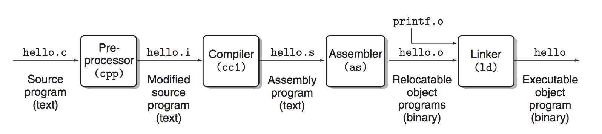

name: inverse
layout: true
class: middle, inverse

---
.title[Computer Systems and Programming]

.author[Gang Chen]

.author[chengangcs@gmail.com]

---

# Outline
* Information in Computer
* How to make the source codes executable?

---

# Information in Computer

---
## Hello World
.left-column[
Text File
````c
#include<stdio>

int main(){
    print("hello world\n");
    return 0;
}
````
]
--

.right-column[
ASCII Characters

````bash
> od -t a src/hello.c
````

````
    0000000    #   i   n   c   l   u   d   e   <   s   t   d   i   o   .   h
    0000020    >  nl  nl   i   n   t  sp   m   a   i   n   (   )   {  nl  sp
    0000040   sp  sp  sp   p   r   i   n   t   f   (   "   H   e   l   l   o
    0000060   sp   W   o   r   l   d   \   n   "   )   ;  nl   }  nl
    0000076
````
]

---

.left-column[
ASCII Characters
````bash
> od -t a src/hello.c
````

````
0000000    #   i   n   c   l   u   d   e   <   s   t   d   i   o   .   h
0000020    >  nl  nl   i   n   t  sp   m   a   i   n   (   )   {  nl  sp
0000040   sp  sp  sp   p   r   i   n   t   f   (   "   H   e   l   l   o
0000060   sp   W   o   r   l   d   \   n   "   )   ;  nl   }  nl
0000076
````
]

--

.right-column[
ASCII Codes

````
> od -t d1 src/hello.c
````

````bash
0000000    35 105 110  99 108 117 100 101  60 115 116 100 105 111  46 104
0000020    62  10  10 105 110 116  32 109  97 105 110  40  41 123  10  32
0000040    32  32  32 112 114 105 110 116 102  40  34  72 101 108 108 111
0000060    32  87 111 114 108 100  92 110  34  41  59  10 125  10
0000076
````
]

---

.left-column[
ASCII Codes
````bash
> od -t d1 src/hello.c
````

````bash
0000000    35 105 110  99 108 117 100 101  60 115 116 100 105 111  46 104
0000020    62  10  10 105 110 116  32 109  97 105 110  40  41 123  10  32
0000040    32  32  32 112 114 105 110 116 102  40  34  72 101 108 108 111
0000060    32  87 111 114 108 100  92 110  34  41  59  10 125  10
0000076
````
]

.right-column[

]

---
Binary


````bash
> xxd -b src/hello.c
0000000: 00100011 01101001 01101110 01100011 01101100 01110101  #inclu
0000006: 01100100 01100101 00111100 01110011 01110100 01100100  de<std
000000c: 01101001 01101111 00101110 01101000 00111110 00001010  io.h>.
0000012: 00001010 01101001 01101110 01110100 00100000 01101101  .int m
0000018: 01100001 01101001 01101110 00101000 00101001 01111011  ain(){
000001e: 00001010 00100000 00100000 00100000 00100000 01110000  .    p
0000024: 01110010 01101001 01101110 01110100 01100110 00101000  rintf(
000002a: 00100010 01001000 01100101 01101100 01101100 01101111  "Hello
0000030: 00100000 01010111 01101111 01110010 01101100 01100100   World
0000036: 01011100 01101110 00100010 00101001 00111011 00001010  \n");.
000003c: 01111101 00001010
````
---

## Non-ASCII Characters?

Code for Chinese
* GB2312 and GB18030 for Simplified Chinese
* BIG5 for Traditional Chinese
* UTF-8 for everything

---

### GB2312 and GB18030

* GB2312 is the registered internet name for a key official character set of the People's Republic of China, used for simplified Chinese characters. GB abbreviates Guojia Biaozhun (国家标准), which means national standard in Chinese. .footnote[see: [GB2312](https://www.wikiwand.com/en/GB_2312)]
* includes 6,763 Chinese characters
* "陈": 1934
* "钢": 2454
* GB18030 is the official character set of the PRC superseding GB2312.
* GBK is a superset of GB2312 developed by Microsoft.
---

### BIG5
* Big5 is a Chinese character encoding method used in Taiwan, Hong Kong, and Macau for Traditional Chinese characters.
* The original Big5 includes 11151 characters.
* "陳": B3AF
* "鋼": BFFB
* EUC-TW (Extended Unix Code) is another traditional Chinese encoding method, but is seldom used.
---

### One World, One Code

````bash
My name in simplified Chinese is 陈钢
My name in traditional Chinese is 陳鋼
お名前は何ですか?
당신의 이름은 무엇입니까?
````
What encoding method should be used for this text file?
--

Unicode

---
### Unicode
Unicode is a computing industry standard for the consistent encoding, representation, and handling of text expressed in most of the world's writing systems.

UTF-8 is an 8-bit variable-width encoding which maximizes compatibility with ASCII.
---

### UTF-8

* My name in simplified Chinese is 陈钢
````
\x4D\x79\x20\x6E\x61\x6D\x65\x20\x69\x6E\x20\x73\x69\x6D\x70\x6C\x69\x66\x69\x65\x64\x20\x43\x68\x69\x6E\x65\x73\x65\x20\x69\x73\x20
\xE9\x99\x88\xE9\x92\xA2
````
* My name in traditional Chinese is 陳鋼
````
\x4D\x79\x20\x6E\x61\x6D\x65\x20\x69\x6E\x20\x74\x72\x61\x64\x69\x74\x69\x6F\x6E\x61\x6C\x20\x43\x68\x69\x6E\x65\x73\x65\x20\x69\x73\x20
\xE9\x99\xB3\xE9\x8B\xBC
````
* お名前は何ですか?
````
\xE3\x81\x8A\xE5\x90\x8D\xE5\x89\x8D\xE3\x81\xAF\xE4\xBD\x95\xE3\x81\xA7\xE3\x81\x99\xE3\x81\x8B
\x3F
````
* 당신의 이름은 무엇입니까?
````
\xEB\x8B\xB9\xEC\x8B\xA0\xEC\x9D\x98\x20
\xEC\x9D\xB4\xEB\xA6\x84\xEC\x9D\x80\x20
\xEB\xAC\xB4\xEC\x97\x87\xEC\x9E\x85\xEB\x8B\x88\xEA\xB9\x8C
\x3F
````
---

## Number

## Integer


### Floating Number


---

## IEEE 754 Floating Point

* Input: 3.1415926
* Single Precision: 0 10000000 10010010000111111011010, 40490FDA
* Double Precision: 0 10000000000 1001001000011111101101001101000100101101100001001010, 400921FB4D12D84A
--

* Single Precision code of 3.1415926 = 3.1415925

---

# How to make the source codes executable?

---

````bash
> gcc -o hello hello
> ./hello
hello world
````

---

## Preprocessing
The preprocessor modifies the original C program
according to directives that begin with the # character.

````bash
> gcc -E hello.c > hello.i
````

---

## Compilation
The compiler translates the text file hello.i into
the text file hello.s, which contains an assembly-language program.

````bash
> gcc -S hello.c > hello.s
````

---

## Assembly
The assembler translates hello.s into machine language instructions.

````bash
gcc -c hello.c > hello.o
````
---

## Linking
The linker merge the functions provide by other compiled object files.

````bash
> gcc -o hello hello.c
````

---
# Run the program

````bash
> ./hello
hello world
````

---



---
# Storage


---
# Operating Systems


---
# Network

---
# Advanced Topics
