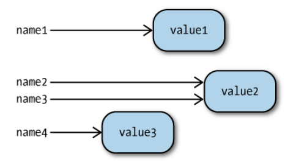

name: inverse
layout: true
class: middle, inverse

---
.title[Elements of Programming]

.author[Gang Chen]

.author[chengangcs@gmail.com]

---
# Outline

* Data types and Operations
* Flow control
* Functions and Modules
* Managing Python files
---

Program = Data Structure + Algorithm

Programming = Designing and Implementing of Data Structure and Algorithm

Lecture 5 : Data Structures and Algorithms
---

1. Basic data types are bricks to build advanced data structures.

2. Flow control statements are the language to describe algorithms.

3. Functions and modules help us organize the source codes of a program.

4. OOP tells us how to design the architecture of your program to integrate data structures and algorithms.

Lecture 3 covers 1-3, and 4 is covered in Lecture 4.

# Data Type and Operations
---
## Simple Data Types
.left-column[
* Type
* Value
]

.right-column[
* Class
* Object
]
---

### Booleans

.left-column[
Possible Values:
* True
* False
]

.right-column[
Logical Operations:
* not
* and
* or
]

---

Empty Values

Following values are treated as False in logical operations:

* None
* 0
* 0.0
* ""
* ''

---

### Integers

.left-column[
Python 2
* int, limited by the size of a C long (typically 32 or 64 bits)
* long, limited only by available memory
]

.right-column[
Python 3
* long
]


---

Implementation of long in CPython

````c
struct _longobject {
    PyObject_VAR_HEAD
    digit ob_digit[1];
};
````
.footnote[Ref: https://www.wikiwand.com/en/Arbitrary-precision_arithmetic]

---

Operations

* +, -, \*, /
* +=, -=, \*=, /=
* \*\*, //
* ==, !=

---
### Floats

* 2.5
* 1.222e24
* .0002
* 10002.

---
### Operations

````python
1.3 - 0.6 == 0.7
False
````
---


---
###Strings

Strings are series of Unicode characters.

* 'Hello World'
* "Hello World"
---

Operations

* in
* +
* x
* Subscription
* Slicing

---
## Variable

---
## Built-in Data Structures
* sets
* mappings
* list
* streams
---

### set
A set is an unordered collection of items that contains no duplicates.
````python
set("ACGT")
set("ACGGGCTATGTGT")
{"AC","CC","AA"}
{"AC", "CC", "AA","AA"}
{"AC", "CC", "AA","AA","CA"}
````
---

Operations
.left-column[
* <=
* <
* >=
* >
]

.right-column[
* |, union
* &, intersection
* -, difference
* ^, symmetric difference
]
---
Operations

* add, remove, discard
* |=, &=, -=, ^=
---
### List
Lists are ordered collections that may contain duplicate elements.

````python
[1,2,3,4,5,6]
[1,2,3,4,5,6, 6]
['A', 'C', 'G', 'T']
['A', 'C', 'G', 'T', 1,2,3,4,5]
[('A', 1), ('C', 2), ('G',3), ('T',4)]
````
---
Operations
* append
* extend
* insert
* remove
* pop
* clear
* index
* count
* sort
* reverse
* copy
* popleft

---
### map
A mapping is a mutable unordered collection of key/value pairs
````python
{'A':1, 'C':2, 'G':3, 'T': 4}
dict([('A', 1), ('C', 2), ('G',3), ('T',4)])
````

---
# Flow Control
---
## Conditional Statements

````python
if expression:
    statements1
else:
    statements2
````
---

## Conditional Statements

````python
if expression1:
    statements1
elif expression2:
    statements2
    # . . . any number of additional elif clauses
else:
    statements
````
---

## Loop

````python
while expression:
    statements1
else:xs
    statements2
````
---
## Iterations
````python
for item in collection:
    do something with item
````
---
## Exception Handling
````python
try:
    try-statements
except ErrorClass:
    except-statements
````
---

# Functions and modules
---

## Functions
A function is a block of organized, reusable code that is used to perform a single, related action.

---
### Defining Functions
````python
def name(parameter-list):
    body
````
---
### Comments and Documentation

ref: https://www.python.org/dev/peps/pep-0257/
---

## Modules
---
### import
````python
import name
````
---
### namespace
````python
from modulename import name1, name2, ...
from modulename import actualname as yourname
from modulename import *

````
---

## Managing Python Files

* create subdirectories for different modules of your program
* add __init__.py to these directories
* Content of __init__.py
````python
# in your __init__.py
from file import File
````
