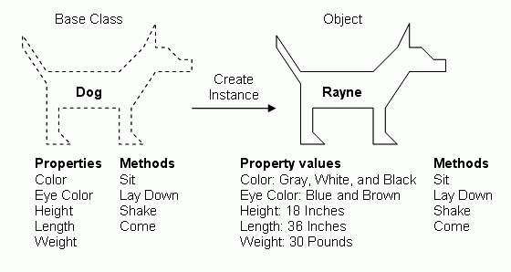

name: inverse
layout: true
class: middle, inverse

---
.title[Object Oriented Programming]

.author[Gang Chen]

.author[chengangcs@gmail.com]

---
# Outline

OOP = Object Oriented Programming
* OOP Basics
* OOP in Python
* Design Pattern in Python
* Examples
---

# OOP Basics
---
## OOP
---
## Classes and Instances
* Objects Combine state (data) and behavior (algorithms).
Encapsulation
* Classes Define what is common for a whole class of objects
---

---

---

### Encapsulation
Dividing the code into a public interface, and a private implementation of that interface.
---

### Polymorphism
The ability to overload standard operators so that they have appropriate behavior based on their context
Inheritance.
---
### Inheritance
The ability to create subclasses that contain specializations of their parents.
---

# OOP in Python

---

# Design Pattern in Python

---

# Examples

---
## BioPython
SeqIO in BioPython:
* [Tutorial](http://biopython.org/DIST/docs/tutorial/Tutorial.html)
* [Source Codes](https://github.com/biopython/biopython/tree/master/Bio/SeqIO)
---
## TADtool
[TADtool: visual parameter identification for TAD-calling algorithms](http://bioinformatics.oxfordjournals.org/content/32/20/3190.full)
