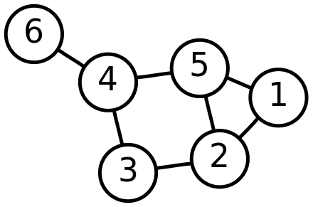

name: inverse
layout: true
class: middle, inverse

---
.title[Data Structure and Algorithm]

.author[Gang Chen]

.author[chengangcs@gmail.com]

---
# Outline

* Why Data Structure and Algorithm
* Important Data Structures
* Algorithm Design and Analysis
* Algorithms and data structures in Bioinformatics
* References
---

# Sorting

## Sorting Algorithms
* Bubble Sorting
* Insertion Sorting
* Merge Sorting
* Quick Sorting
---

## Comparison of Sorting Algorithms

* Small dataset
* Large dataset

## Performance of Sorting Algorithms

* Running time
* Number of comparisons
* Big O Concept

---
# Shortest Path
---
## Problem
The **shortest path problem** is the problem of finding a path between two nodes in a graph such that the length is minimized.
---

## Data Structure: Graph

How to store a Graph in computer?

* OOP: graph class (<a href="src/graph/graph.py">graph.py</a>).

---

## Shortest Path

* Dijkstra's Algorithm
* A star algorithm

---
## Comparison

---
## Discussion
* Weight Graph
* Negative weight
* Cycle
---

# Algorithms in Bioinformatics
---
## Smith-Waterman Sequence Alignment
---
## Random Walk and Page Rank
